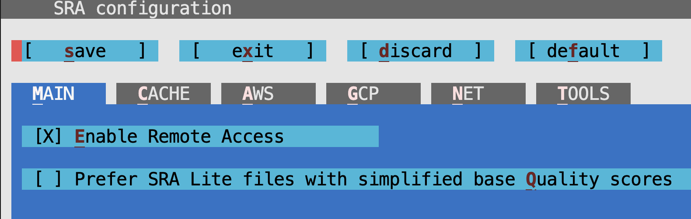

# bulk_rnaseq_tutorial
- required tools: [Docker](https://docs.docker.com/get-started/get-docker/)
- make sure you have a dockerhub account

## run project locally

### 1) download repo
```
git clone https://github.com/CompBio-Lab/bulk_rnaseq_tutorial.git
cd bulk_rnaseq_tutorial/
```

### 2) create docker image locally
- change DOCKERHUB_USERNAME variable in Makefile to your dockerhub username
- NOTE: if you don't plan to push the image to dockerhub, you can assign DOCKERHUB_USERNAME to any variable name

```
make build
```

### 3) run docker container locally
- add path to 
```
make run
```

### 4) setup project locally

```
cd local
make setup  
```

### 5) [configure SRAtoolkit](https://github.com/ncbi/sra-tools/wiki/03.-Quick-Toolkit-Configuration)
- when you first run the docker image you will need to configure the sra toolkit by:
```
make configsra
```

-- you will get a screen that looks like the following:



- enable remote access (hit tab to move and hit enter to select)
- save and exit

### 6) prefect SRA file
- the prefetch tool downloads all necessary files to your computer. 

```
make prefetchsra
```

### 6) extract SRA file

```
make extractsra
```

### 7) apply FASTQC on FASTQ files
```
make fastqc
```

### 8) trim FASTQ files
```
make trim
```

### 9) apply FASTQC to trimmed FASTQ files
```
make fastqc_trim
```

### 10) download genome in data folder
```
make genome
```

### 11) download gtf in data folder
```
make gtf
```

### 12) align trimmed reads

```
make align
```

### 13) count trimmed reads

```
make count
```


## run project on HPC (Sockeye)


## pull docker image on hpc
- set $ALLOC=st-allocation-1
- make user dir if not already

```
cd /scratch/$ALLOC/$USER/
module load git
git clone https://github.com/CompBio-Lab/bulk_rnaseq_tutorial.git
cd bulk_rnaseq
mkdir data results results/fastqc results/trim results/align results/counts
```

## download docker image 
```
cd data
module load gcc apptainer
DOCKERHUB_USERNAME=singha53
IMAGE_VERSION=v0.1
IMAGE_NAME=rnaseq
apptainer pull --name bulk_rnaseq.sif docker://$DOCKERHUB_USERNAME/$IMAGE_NAME:$IMAGE_VERSION
```

## download genome in data folder
```
mkdir data
cd
wget https://genome-idx.s3.amazonaws.com/hisat/grch38_genome.tar.gz 
tar -xvzf grch38_genome.tar.gz
rm grch38_genome.tar.gz
```

## download genome and gtf in data folder
```
wget https://ftp.ensembl.org/pub/release-112/gtf/homo_sapiens/Homo_sapiens.GRCh38.112.gtf.gz && \
gzip -d Homo_sapiens.GRCh38.112.gtf.gz
```

## run analysis

### run fastqc
```
cd analysis
sbatch run_fastqc.sh
```
- [how to interpret fastqc doc](https://hbctraining.github.io/Intro-to-rnaseq-hpc-salmon/lessons/qc_fastqc_assessment.html)

### run trimmomatic
- [trimmomatic docs](http://www.usadellab.org/cms/uploads/supplementary/Trimmomatic/TrimmomaticManual_V0.32.pdf)

```
mkdir results/trim
cd bulk_rnaseq/analysis/
sbatch run_trim.sh
```

### run fastqc on trimmed fastq files

```
cd bulk_rnaseq/analysis/
sbatch run_fastqc_trim.sh
```

### align trimmed reads

```
cd bulk_rnaseq/analysis/
sbatch run_align.sh
```

### count trimmed reads

```
cd bulk_rnaseq/analysis/
sbatch run_count.sh
```

### download results folder from remote to local
```
local_path="path to folder where you want to copy to"
remote_path="remote path of folder you want to copy"
cp -r cwl@dtn.sockeye.arc.ubc.ca:$remote_path $local_path
```
- cwl is you ubc cwl

## helpful commands

### count number of lines in a FASTQ file
```
$(cat name.fastq | wc -l)
```

### display top 20 lines in a FASTQ file
```
name.fastq | head -n 20
```
